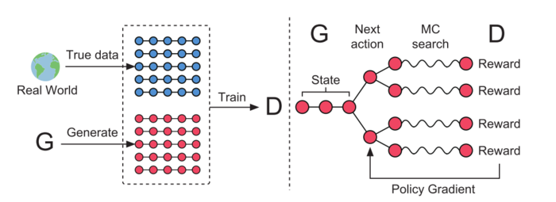

# SeqGAN

[Paper链接](https://arxiv.org/pdf/1609.05473.pdf)

### 1. 背景

GAN:简单来说，就是在生成的过程中加入一个可以鉴别真实数据和生成数据的鉴别器，
使生成器G和鉴别器D相互对抗，D的作用是努力地分辨真实数据和生成数据，
G的作用是努力改进自己从而生成可以迷惑D的数据。
当D无法再分别出真假数据，则认为此时的G已经达到了一个很优的效果。

GAN的优点:
- 可以生成更好的样本
- 模型只用到了反向传播,而不需要马尔科夫链
- 训练时不需要对隐变量做推断
- G的参数更新不是直接来自数据样本,而是使用来自D的反向传播
- 理论上,只要是可微分函数都可以用于构建D和G,因为能够与深度神经网络结合做深度生成式模型

它的最后一条优点也恰恰就是它的局限,在NLP中，数据不像图片处理时是连续的,可以微分，
我们在优化生成器的过程中不能找到“中国 + 0.1”这样的东西代表什么，
因此对于离散的数据，普通的GAN是无法work的。
SeqGAN的作者,一位在读本科生(emmmmmm),想到了使用RL来解决这个问题.

### 2.主要内容

如上图（左）所示，仍然是对抗的思想，真实数据加上G的生成数据来训练D。
但是我们可以知道G的离散输出，让D很难回传一个梯度用来更新G，因此需要做一些改变，
看上图（右），paper中将policy network当做G，已经存在的红色圆点称为现在的状态（state），
要生成的下一个红色圆点称作动作（action），因为D需要对一个完整的序列评分，
所以就是用MCTS（蒙特卡洛树搜索）将每一个动作的各种可能性补全，
D对这些完整的序列产生reward，回传给G，通过增强学习更新G。
这样就是用Reinforcement learning的方式，训练出一个可以产生下一个最优的action的生成网络。

### .GAN和NLP
GAN在NLP的应用,目前主要思路都是考虑D用来做真假判别，然后用rl的policy  gradient的方式来打分和更新。
<b>为什么采用policy gradient，而不是直接用gradient?可能的原因:</b>
- 离散的序列在梯度微调时没有意义。即使用的是word2vec之类连续的，微调之后可能得到一个什么都不代表的向量。
- 生成的向量是在空间里的，基本不可能对应到有意义的点（word），那么只能取最近的，
那么如果这个向量做了优化，对GAN来说是非常敏感的，也许判别器就更难判断了，
但是对词典里的词，是不敏感的，也许距离这个生成的向量的距离的排序没有改变。

对抗生成文本的方法:目前最主要的就是policy gradient和gumble softmax了.
gumble softmax，它可以代替policy gradient，直接可导。

GAN解决这类离散型序列问题的弊端:
- 离散数据的连续embedding空间的矛盾，只能做近似；policy gradient和gumble softmax存在bias
- 在生成text时，GAN对整个文本序列进行建模打分。对于部分(partially)生成的序列，十分难判断其在之后生成整个 (fully) 序列时的分数。
- 另一个潜在的挑战涉及RNN的性质（生成文本大多采用RNN模型）。
假设我们试图从latent codes生成文本，error就会随着句子的长度成指数级的累积。
最开始的几个词可能是相对合理的，但是句子质量会随着句子长度的增加而不断变差。
另外，句子的长度是从随机的latent representation生成的，所以句子长度也是难以控制。
- 这个误差一直积累的问题，能不能加上self attention搞搞事情,attention用到GAN的框架下？

IRGAN

### 参考
* https://www.jianshu.com/p/b8c3d2a42ba7

* https://www.jianshu.com/p/32e164883eab
